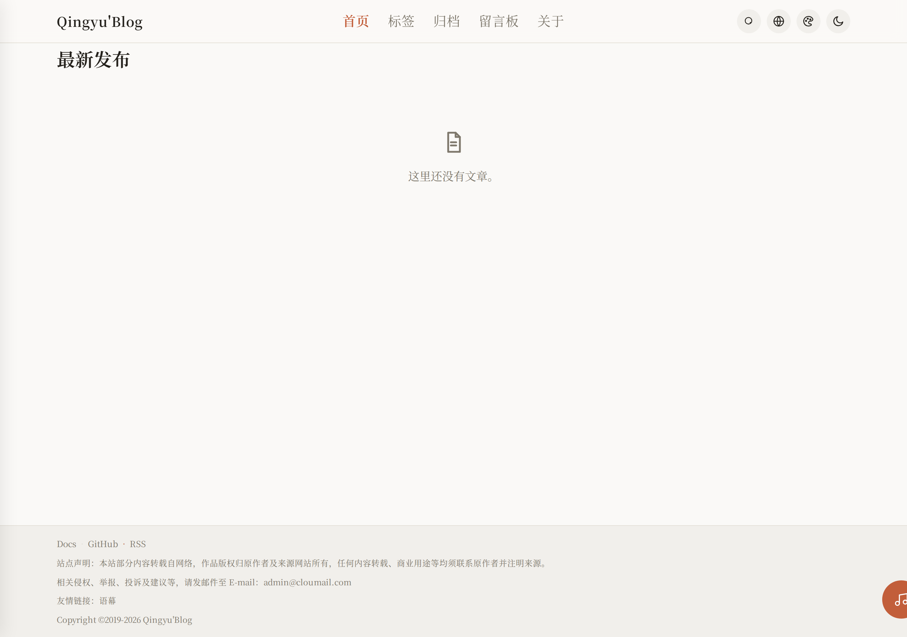

<p align="center">
  
</p>

<h1 align="center">Qingyu'Blog</h1>

<p align="center">
  <b>Zero framework · Zero build · Zero dependency — a personal blog you can open by double-clicking</b>
</p>

<p align="center">
  <a href="https://www.2024921.xyz">
    
  </a>
  
  
  
</p>

<p align="center">
  <a href="https://github.com/kejiland/qingyu-blog/stargazers">
    
  </a>
  <a href="https://github.com/kejiland/qingyu-blog/network/members">
    
  </a>
  <a href="https://github.com/kejiland/qingyu-blog/issues">
    
  </a>
  <a href="https://github.com/kejiland/qingyu-blog/pulls">
    
  </a>
</p>

<p align="center">
  
  
  
  
  <a href="https://github.com/kejiland/qingyu-blog/blob/main/LICENSE">
    
  </a>
</p>

---

## 📑 Table of Contents

- [📖 About](#-about)
- [✅ Why Choose This](#-why-choose-this)
- [✨ Features](#-features)
- [🚀 Deployment](#-deployment)
- [☁️ Cloudflare Services](#️-cloudflare-services)
- [⚙️ Configuration](#️-configuration)
- [🛡️ Security](#️-security)
- [🧪 Tests](#-tests)
- [🖼️ Screenshots](#️-screenshots)
- [📄 License](#-license)

## 📖 About

Qingyu'Blog is a personal blog system built with **pure vanilla JavaScript** — no frameworks (React / Vue / Svelte), no build tools (Webpack / Vite), no third-party dependencies.

It runs in two modes:

| Mode | Description | Use Case |
| --- | --- | --- |
| **Static** | Double-click `index.html`, data in browser localStorage | Local writing, quick preview |
| **Cloud** | Deploy to Cloudflare Workers + D1, data in cloud database | Production, public access |

The entire site lives in `public/`: frontend `index.html` + `style.css` + `app.js` + `posts.js`, admin `admin.js` + `admin.css`, i18n `i18n.js` + `locales/`. No third-party runtime is required.

> 💡 The root `index.html` is just a redirect that opens `public/index.html` (the Cloudflare Pages / Workers deploy directory). Double-clicking `public/index.html` locally works the same.

---

## ✅ Why Choose This

| Advantage | Description |
| --- | --- |
| **Zero barrier** | No Node.js, no npm, no build steps — just double-click to run |
| **Zero cost** | Cloudflare Workers + D1 free tier is more than enough for a personal blog |
| **Zero dependency** | No third-party libraries, fully controllable codebase, blazing fast |
| **Zero lock-in** | Posts are Markdown files, portable to any platform anytime |
| **Dual channel** | Static export + Cloud API, same codebase two deployment options |
| **Responsive** | Frontend + admin panel, fully adapted for phone / tablet / desktop |
| **Multilingual** | Built-in Chinese / English / 日本語 / 한국어 / हिन्दी UI, auto-detects browser language |
| **Serif aesthetics** | Four-tier serif font stack (Source Han Serif / GenYo Mincho / Dream Han Serif / Zhuque Fangsong) |
| **Secure** | PBKDF2-SHA256 salted password hashing (100k iterations), session token auth, login rate-limit lockout, security response headers (CSP / nosniff / frame protection) |
| **AI enhanced** | Workers AI powers post summaries / writing assistant / comment summaries; degrades gracefully with zero impact when unconfigured |

---

## 📁 Directory Structure

```
├── public/                          # Site assets (static, deploy directory)
│   ├── index.html                   # Entry point (double-click / deploy)
│   ├── config.js                    # Site config (footer / ads / mode / language)
│   ├── style.css                    # Frontend styles (dark mode + responsive + 4-tier serif)
│   ├── app.js                       # Frontend logic (routing / comments / encryption / search / i18n / theme color / AI summary)
│   ├── admin.js                     # Admin panel SPA (dashboard / posts / comments / tags / settings / AI assistant / comment summary)
│   ├── admin.css                    # Admin styles (responsive layout)
│   ├── i18n.js                      # i18n module (zh/en/ja/ko/hi, with Chinese fallback)
│   ├── posts.js                     # Static mode post data (generated by "Export posts.js")
│   ├── locales/                     # Language packs (zh-CN / en / ja / ko / hi)
│   ├── fonts/dreamserif/            # Local split serif font (Dream Han Serif CN / QY-Display)
│   # feed.xml / sitemap.xml are generated dynamically by functions/ in cloud
│   ├── robots.txt                   # Crawler rules (blocks admin, declares Sitemap)
│   └── _redirects                   # Cloudflare Pages routes (SPA fallback + /public redirect)
├── functions/                       # Cloudflare API (shared by Pages Functions / Workers)
│   ├── api/
│   │   ├── posts.js                 # Posts CRUD
│   │   ├── posts/[id]/
│   │   │   ├── index.js             # Single post (GET / PUT / DELETE)
│   │   │   ├── comments.js          # Post comments (GET / POST, nested replies)
│   │   │   ├── comments/[cid].js    # Single comment delete (admin)
│   │   │   └── stats.js             # View / like stats
│   │   ├── comments.js              # Global comment list (admin)
│   │   ├── comments/[id].js         # Comment approve / delete
│   │   ├── ai/
│   │   │   ├── ping.js              # AI availability probe (degradation switch)
│   │   │   ├── summary.js           # Post summary (per-post 30-day cache + rate limits)
│   │   │   ├── assist.js            # Writing assistant (title suggestions / polish / translate)
│   │   │   └── comments.js          # Comment summary / single-comment spam screening
│   │   ├── media.js                 # Media library
│   │   ├── media/[id].js            # Media delete
│   │   ├── settings.js              # Site settings
│   │   ├── site-files/              # Site artifacts (feed.xml / sitemap.xml / posts.js)
│   │   │   ├── index.js             # List / save artifacts
│   │   │   └── [name].js            # Download artifact content
│   │   ├── admin/
│   │   │   ├── setup.js             # First-time password setup
│   │   │   ├── login.js             # Password login
│   │   │   ├── logout.js            # Logout
│   │   │   └── password.js          # Change password
│   │   ├── stats/trend.js           # 30-day trend data
│   │   ├── feed.xml.js              # /api/feed.xml dynamic RSS (legacy entry)
│   │   └── sitemap.xml.js           # /api/sitemap.xml dynamic Sitemap (legacy entry)
│   ├── feed.xml.js                  # root /feed.xml dynamic RSS (latest cloud posts)
│   ├── sitemap.xml.js               # root /sitemap.xml dynamic Sitemap (latest cloud posts)
│   └── _lib/
│       ├── api-core.js              # API core logic (D1 + auth + security)
│       └── ai.js                    # Workers AI wrapper (model / prompts / rate limits / fallback)
├── worker.js                        # Cloudflare Workers entry (route dispatch, incl. /api/ai/* wiring)
├── migrations/                      # D1 database migrations (auto-applied by CI, idempotent)
│   ├── 0001_init.sql                # Base tables
│   ├── 0002_site_files.sql          # Site file storage
│   ├── 0003_cover_column.sql        # Cover image field
│   ├── 0004_post_meta.sql           # Category / status fields
│   ├── 0005_comment_status.sql      # Comment moderation status
│   ├── 0006_media.sql              # Media library table
│   ├── 0007_settings.sql            # Site settings table
│   ├── 0008_stats_daily.sql         # Daily stats table
│   ├── 0009_comment_status_index.sql # Comment status index
│   ├── 0010_admin_must_change.sql   # Forced password change flag
│   ├── 0011_comment_reply.sql       # Comment reply parent_id field
│   └── 0012_clear_orphaned_nav.sql  # Clean up legacy nav config
├── scripts/
│   └── migrate-kv-to-d1.mjs         # One-off migration: KV data → D1
├── .github/workflows/
│   ├── deploy.yml                   # GitHub Actions auto-deploy to Workers
│   └── migrate-kv-to-d1.yml         # Manual KV → D1 migration
├── seed.js                          # Import sample posts into the cloud API
├── _addtheme.py                     # Historical script: inject theme toggle (already in source, no need to run)
├── wrangler.toml                    # Cloudflare Pages config
├── wrangler.workers.toml            # Cloudflare Workers config
├── smoke-test.js                    # Smoke tests
├── README.md                        # 中文说明
└── README_EN.md                     # English docs
```

---

## ✨ Features

### Frontend

| Feature | Description |
| --- | --- |
| Real-path routing | No hash: `/`, `/archive`, `/about`, `/tags`, `/guestbook`, `/posts/<alias>/`, `/admin`, `/write` — no 404 on refresh |
| Markdown Editor | Live preview, one-click toolbar, word count, autosaved drafts |
| Article Encryption | API reserves `enc` / `protected` fields (import-compatible); editor UI does not expose encryption yet |
| Comments | Cloud D1 global comments + moderation; static mode localStorage; **nested replies**; **duplicate-post blocking** (same section + same author + same content → 409) |
| Guestbook | One click away at `/guestbook`, dual sections (messages / feature ideas), cloud-stored, reuses the comment security pipeline (rate limiting / Origin check / control-char sanitizing / duplicate blocking) |
| Site Search | Real-time matching of title / tags / excerpt; results show the **full sentence around each keyword** with **keyword highlighting**, no underline on hover |
| TOC | Auto-generated with anchor jumps; syntax highlighting |
| Read Stats | Views / likes (cloud-global / local) |
| Featured Articles | Auto-recommended below comments (likes×3 + views + comments×5) |
| RSS / Sitemap | `/feed.xml` and `/sitemap.xml` are generated dynamically in cloud and auto-update after post CRUD; encrypted posts excluded |
| Prev/Next | Hides empty slot when only one direction exists |
| Card List | Cover thumbnails, pin badge, tags pinned to bottom |
| Dark / Light Theme | One-click toggle, responsive multi-breakpoint |
| Accent Color Picker | 6 accent colors — icon button + popover on desktop, native select on mobile, works in both themes |
| Multilingual UI | Chinese / English / 日本語 / 한국어 / हिन्दी, auto-detect + manual switch (🌐 icon popover on desktop, native select on mobile) |
| AI Post Summary | One-click AI summary on every post page, per-post 30-day cache; entry auto-hides when AI is unavailable |
| Four-tier serif | Body Source Han Serif · headings GenYo Mincho · display Dream Han Serif · quotes Zhuque Fangsong |

### Admin Panel

| Feature | Description |
| --- | --- |
| Dashboard | 6 stat cards + 30-day visits / comments trend charts |
| Post Management | Search / status filter / pagination / pin toggle / encrypt toggle; **seamless delete** (row fades out in place, list and public site update instantly, no page reload) |
| Editor | Markdown live preview (input auto-grows), tags / cover / pin / encrypt |
| **AI Writing Assistant** | One-click title suggestions / polish / translate (selectable target language), result can be applied or copied; auto-hides when AI is unavailable |
| Comment Management | Global comment list, approve / delete, reply-chain tracing; **seamless approve / delete** (row-level fade-out + in-place status badge update, no full-list reload) |
| **AI Comment Summary** | Summarize recent comment threads (1-hour cache) + single-comment spam screening |
| Tag Management | Rename / delete tags (bulk update all related articles) |
| Media Library | Image upload (base64 to D1) |
| Blog Settings | Site info (incl. site avatar — also the top-left brand logo and favicon) / profile (avatar shown bottom-left) / navigation menu |
| One-click Export | Export posts.js / feed.xml / sitemap.xml together, overwrite to publish |
| Top Bar | 🌐 language popover on the right (same style as the public site, SVG flags) + account menu (profile / change password / logout) |
| Brand Area | Animated gradient logo block (site logo or first letter) + site name; collapsible sidebar — collapsed footer keeps only the avatar, centered |
| Responsive | Fixed sidebar on desktop, drawer navigation on mobile |

---

## 🚀 Deployment

### Option 1: Local Static

```bash
git clone https://github.com/kejiland/qingyu-blog.git
cd qingyu-blog
```

Double-click `public/index.html`, or start a local server:

```bash
# Python
python -m http.server 8080 -d public

# Node.js
npx serve public
```

Open `http://localhost:8080/admin`, set a password and start writing.

### Option 2: Cloudflare Workers (Recommended)

#### 1. Prerequisites


- [Cloudflare account](https://dash.cloudflare.com/sign-up)
- [Wrangler CLI](https://developers.cloudflare.com/workers/wrangler/install-and-update/): `npm install -g wrangler`

#### 2. Create Cloudflare Resources

```bash
# Login to Cloudflare
npx wrangler login

# Create D1 database (primary storage: posts / comments / stats / passwords)
npx wrangler d1 create blog
# Save the database_id (a UUID — not the DB name, not the KV id)

# Create KV namespace (backup binding)
npx wrangler kv namespace create BLOG
# Save the id (32 hex chars)
```

#### 3. Configure GitHub Secrets

Add in repo Settings → Secrets and variables → Actions:

| Secret | Required | Description |
| --- | --- | --- |
| `CLOUDFLARE_API_TOKEN` | ✅ | Cloudflare API Token (Workers + D1 + KV permissions) |
| `CLOUDFLARE_ACCOUNT_ID` | ✅ | Cloudflare Account ID (visible on Dashboard sidebar) |
| `BLOG_D1_ID` | ✅ | D1 Database ID (from step 2, UUID format) |
| `BLOG_KV_ID` | ✅ | KV Namespace ID (from step 2, 32 hex chars) |
| `BLOG_ADMIN_SETUP_KEY` | Optional | Setup key: when set, `/api/admin/setup` requires `X-Setup-Key` for first init & reset (anti-squatting, recommended); when unset, falls back to legacy behavior — first deploy auto-generates a random default password on login (first-come race exists; configure it for fresh deployments). Logged-in instances are unaffected |
| `SITE_URL` | Recommended | Public domain, e.g. `https://blog.example.com` (tightens CORS / RSS / Sitemap) |
| `CF_ZONE_ID` | Optional | Custom domain Zone ID (enables cache purge on publish) |

#### 4. Deploy

Push to `main` branch, GitHub Actions will automatically:

1. ✅ Validate required Secrets
2. ✅ Run D1 migrations (`schema_migrations` ledger, ordered & idempotent; legacy duplicate-column auto-skip)
3. ✅ Deploy Worker to Cloudflare
4. ✅ Write runtime Secrets (`BLOG_ADMIN_SETUP_KEY`, etc.)

After deployment, visit `https://www.2024921.xyz/admin`:
- First deploy (with `BLOG_ADMIN_SETUP_KEY` set): click "First deploy? Initialize with setup key", enter a new admin password + setup key;
- First deploy (without setup key): log in once with any password — the backend auto-generates a random default password (`xxxx-xxxx`) and shows it; use it to log in, then change it (forced);
- Then log in normally.

#### 5. Migrate from KV to D1 (legacy data)

If you previously used KV single-key storage, run the migration workflow to move data into D1:

```bash
# Local (requires CLOUDFLARE_ACCOUNT_ID / CLOUDFLARE_API_TOKEN / BLOG_KV_ID / BLOG_D1_ID)
node scripts/migrate-kv-to-d1.mjs --dry-run   # preview SQL only
node scripts/migrate-kv-to-d1.mjs             # write to D1
```

Or manually trigger the `Migrate KV to D1` workflow in the repo Actions tab (repo Secrets auto-injected; supports `dry-run` / `migrate` modes).

---

## ☁️ Cloudflare Services

### Workers

Workers is Cloudflare's edge computing platform. This project uses it to run the backend API:

- **Entry**: `worker.js` (route dispatch) + `functions/` (Pages Functions)
- **Assets**: `public/` directory served via Workers `[assets]` binding
- **Compatibility date**: `2025-02-01`

**Key wrangler.workers.toml config**:

```toml
name = "kejiland"
main = "worker.js"

[assets]
directory = "./public"
binding = "ASSETS"
not_found_handling = "single-page-application"  # SPA fallback
html_handling = "auto-trailing-slash"

[[kv_namespaces]]
binding = "BLOG"
id = "{env.BLOG_KV_ID}"

[[d1_databases]]
binding = "DB"
database_name = "blog"
database_id = "{env.BLOG_D1_ID}"

[ai]                          # Workers AI (binding must be named AI — powers summary / assistant / comment tools)
binding = "AI"
```

### KV (Key-Value Storage)

KV is used as a backup binding (largely replaced by D1). Current uses:

| Purpose | Description |
| --- | --- |
| Like dedup | `liked:{ip}:{postId}` — prevents like spam |
| File cache | feed.xml / sitemap.xml / posts.js caching |
| Cache purge | `purge:{tag}` — version control |

> ⚠️ KV is **eventually consistent** (global propagation has delay). Not suitable for strong consistency needs. D1 is SQLite with strong consistency.

### D1 (SQLite Database)

D1 is Cloudflare's edge SQLite database — the **primary storage** for this project:

| Table | Description | Key Fields |
| --- | --- | --- |
| `posts` | Articles | id, title, content, cover, pinned, protected, enc, tags, category, status |
| `comments` | Comments | id, post_id, author, content, date, status (approved/pending), **parent_id** (reply) |
| `stats` | Views/likes | post_id, views, likes |
| `admin_auth` | Admin password | k, salt, hash, iter, must_change |
| `admin_sessions` | Login sessions | token, exp |
| `admin_fails` | Rate limiting | ip, n, until |
| `media` | Media library | id, name, url, type, size |
| `site_settings` | Site config | k, v (key-value) |
| `site_files` | Site artifacts | name, content, updated_at (feed/sitemap/posts.js) |
| `stats_daily` | Daily stats | post_id, date, views, likes |

### Workers AI (Inference)

Cloudflare Workers AI (default model `@cf/meta/llama-3.2-3b-instruct`) powers the writing tools; billed in Neurons with a **free daily allowance of 10,000 Neurons** (thousands of summary-level calls; beyond that ≈ $0.011 per 1k Neurons):

| Endpoint | Purpose |
| --- | --- |
| `GET /api/ai/ping` | Availability probe (front-end shows/hides all AI entries based on this) |
| `POST /api/ai/summary` | Post summary (per-post 30-day cache; IP 8/hour, site-wide 300/day) |
| `POST /api/ai/assist` | Writing assistant: title suggestions / polish / translate (auth required, 200/day per IP) |
| `POST /api/ai/comments` | Comment summary (1-hour cache) + single-comment spam screening (auth required) |

- Config: `[ai] binding = "AI"` in `wrangler.workers.toml` (binding is created automatically on deploy); set env var `BLOG_AI_ENABLED` to `0` / `false` / `off` to disable entirely
- **Graceful degradation**: if AI is not bound, D1 is missing, or the switch is off, the endpoints return 404 and the front-end (`aiProbe`) hides every AI entry — the rest of the blog is completely unaffected
- Front-end memory: "available" results are cached 10 minutes, "unavailable" only 30 seconds, so the UI recovers right after AI goes live or is fixed
- **Privacy note**: post summaries / writing assistant / comment summaries send the relevant **plaintext content** to Cloudflare Workers AI (`@cf/meta/llama-3.2-3b-instruct`) for inference. Avoid enabling these entries for sensitive content (or set `BLOG_AI_ENABLED=0` to disable entirely)

---

## ⚙️ Configuration

### config.js

```javascript
window.BLOG_CONFIG = {
  // ====== Basic ======
  mode: 'auto',           // 'auto' | 'static' | 'api'
  apiBase: '',            // API base URL, empty = same origin
  siteUrl: 'https://www.2024921.xyz', // Public site URL (for RSS/Sitemap)
  writeToken: '',         // Legacy write token (use login instead)
  pageSize: 5,            // Posts per page (0 = no pagination)
  adminPwd: '',           // Static mode local password (leave empty for cloud)

  // Navigation items live in public/app.js (NAV array, single source of truth)

  // ====== Footer ======
  footer: {
    text: '',
    icp: '',               // ICP filing number
    contact: [],           // Contact links
    links: [],             // Friendly links
    decl: '',              // Site declaration
    email: '',             // Contact email
    startYear: 2019,       // Copyright start year
    copyrightName: "Qingyu'Blog"
  },

  // ====== Ads ======
  ads: {
    enabled: false,
    belowSearch: '',       // Above post list
    between: '',           // Between posts
    betweenEvery: 3,       // Every N posts
    content: ''            // Article detail bottom
  }
};
```

### mode Options

| Value | Behavior |
| --- | --- |
| `'auto'` | **Recommended**. Auto-detect: `/api/posts` succeeds → cloud; fails → static |
| `'static'` | Force static mode, posts.js only |
| `'api'` | Force cloud mode, requires backend API |

### Multilingual (i18n)

`i18n.js` ships 5 languages (Chinese / English / 日本語 / 한국어 / हिन्दी). It auto-detects `navigator.language` by default with a manual switcher. Language packs live in `public/locales/<lang>.json` (Chinese is also embedded as a fallback so core text stays readable under `file://` local preview).

---

## 🛡️ Security

| Layer | Mechanism |
| --- | --- |
| Password storage | PBKDF2-SHA256 salted hash (100,000 iterations), never plaintext |
| First deploy | With `BLOG_ADMIN_SETUP_KEY` set: explicit init via `/api/admin/setup` + `X-Setup-Key`, login before init returns 403 (anti-squatting); unset: login auto-generates a random default password (`xxxx-xxxx`, `mustChange=true`, forced to change after login; first-come race exists). Password min 8 chars |
| Static mode | Passwords stored as SHA-256 hashes (backward-compatible, auto-upgraded) |
| Session management | Random Token (32-byte hex), 7-day expiry, destroyed on logout |
| Rate limiting | 5 consecutive failures from same IP = 15-minute lockout |
| Article encryption | API reserves `enc` / `protected` fields (can import externally encrypted posts); editor end-to-end encryption UI not yet enabled |
| Comment security | XSS escaping + parameterized queries + per-IP rate limit + Origin validation + **duplicate-post blocking** (same section + same author + same content → 409) |
| API boundary | Unknown /api/* returns JSON 404, never falls back to index.html |
| CORS | With `SITE_URL` set, only same-origin allowed; else echoes request origin |

---

## 🧪 Tests

```bash
node smoke-test.js      # Smoke tests: 76 cases
node gb-verify.js       # Guestbook verification: 18 cases
node search-verify.js   # Search verification: 13 cases
```

Covers: Markdown rendering, TOC, syntax highlighting, import/export, admin gate, pinning, archive, tags, comment security, encryption, stats, search, RSS, Sitemap, cloud APIs, caching. All three suites run automatically before each CI deploy.

Import sample posts into a deployed cloud instance:

```bash
node seed.js https://www.2024921.xyz [--token <session or write token>]
```

---

## 🖼️ Screenshots

| Home (light) | Article | Editor |
| --- | --- | --- |
|  |  |  |

| Admin · Dashboard | Comments | Mobile |
| --- | --- | --- |
|  |  |  |

### Serif font preview

| Home (light) | Article (light) | Article (dark) |
| --- | --- | --- |
|  |  |  |

---

## 📄 License

[MIT](LICENSE)

---

<p align="center">
  If Qingyu'Blog helps you, feel free to ⭐ Star / Fork, or open an <a href="https://github.com/kejiland/qingyu-blog/issues">Issue</a>.
</p>

<p align="center">
  <b>If you find this project useful, please give it a ⭐ Star — it helps others discover it!</b>
</p>